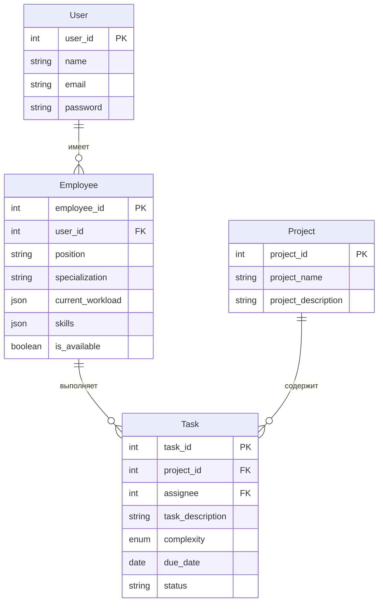

# fastapi-taskman
# Task Manager API

REST API для системы управления задачами, разработанное с использованием FastAPI и SQLModel.

## Описание

Task Manager API - это система управления задачами, которая позволяет:
- Управлять проектами и задачами
- Назначать задачи сотрудникам
- Отслеживать статус выполнения задач
- Управлять навыками и специализациями сотрудников
- Автоматически распределять задачи между сотрудниками

## Технологии

- Python 3.8+
- FastAPI
- SQLModel (SQLAlchemy + Pydantic)
- SQLite
- JWT для аутентификации
- Pydantic для валидации данных

## Установка

1. Клонируйте репозиторий:
```bash
git clone https://github.com/shmidt-ilya/task_manager.git
cd task_manager
```

2. Создайте виртуальное окружение и активируйте его:
```bash
python -m venv .venv
source .venv/bin/activate  # для Linux/Mac
.venv\Scripts\activate     # для Windows
```

3. Установите зависимости:
```bash
pip install -r requirements.txt
```

4. Инициализируйте базу данных:
```bash
python -m app.init_db
```

5. Запустите приложение:
```bash
uvicorn app.main:app --reload
```

## Использование

После запуска приложения, API будет доступно по адресу: http://localhost:8000

### Документация API

- Swagger UI: http://localhost:8000/docs
- ReDoc: http://localhost:8000/redoc

### Основные эндпоинты

#### Аутентификация
- POST /auth/token - получение JWT токена
- POST /auth/register - регистрация нового пользователя

#### Проекты
- GET /projects - список всех проектов
- POST /projects - создание нового проекта
- GET /projects/{project_id} - информация о проекте
- PUT /projects/{project_id} - обновление проекта
- DELETE /projects/{project_id} - удаление проекта

#### Задачи
- GET /tasks - список всех задач
- POST /tasks - создание новой задачи
- GET /tasks/{task_id} - информация о задаче
- PUT /tasks/{task_id} - обновление задачи
- DELETE /tasks/{task_id} - удаление задачи
- POST /tasks/{task_id}/assign - назначение задачи сотруднику
- POST /tasks/{task_id}/complete - завершение задачи

#### Сотрудники
- GET /employees - список всех сотрудников
- POST /employees - создание нового сотрудника
- GET /employees/{employee_id} - информация о сотруднике
- PUT /employees/{employee_id} - обновление информации о сотруднике
- DELETE /employees/{employee_id} - удаление сотрудника
- GET /employees/{employee_id}/tasks - задачи сотрудника
- GET /employees/{employee_id}/skills - навыки сотрудника

## Тестирование

Для запуска тестов используйте:
```bash
pytest
```

## Линтинг

Для проверки кода используйте:
```bash
pylint app
```

## Структура проекта

```
task_manager/
├── app/
│   ├── __init__.py
│   ├── main.py
│   ├── db.py
│   ├── init_db.py
│   ├── schemas/
│   │   ├── __init__.py
│   │   ├── task.py
│   │   └── employee.py
│   └── routers/
│       ├── __init__.py
│       ├── auth.py
│       ├── projects.py
│       ├── tasks.py
│       └── employees.py
├── tests/
│   └── __init__.py
├── data/
│   └── taskman.db
├── requirements.txt
├── README.md
└── .pylintrc
```

# Task Manager API

REST API для системы управления задачами, разработанное с использованием FastAPI и SQLModel.

## Описание

Task Manager API - это система управления задачами, которая позволяет:
- Управлять проектами и задачами
- Назначать задачи сотрудникам
- Отслеживать статус выполнения задач
- Управлять навыками и специализациями сотрудников
- Автоматически распределять задачи между сотрудниками

## ER-диаграмма



## Технологии
## Лицензия

MIT

## Автор

Илья Шмидт
